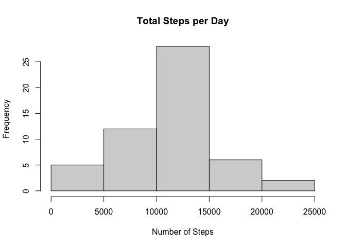
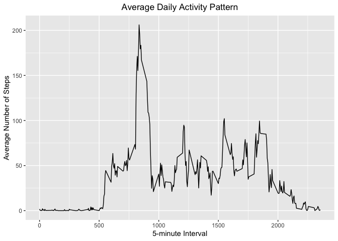
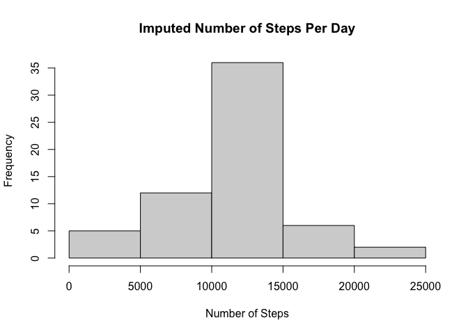

```r
library(dplyr)
```

```
## 
## Attaching package: 'dplyr'
```

```
## The following objects are masked from 'package:stats':
## 
##     filter, lag
```

```
## The following objects are masked from 'package:base':
## 
##     intersect, setdiff, setequal, union
```

```r
library(ggplot2)
```


## Loading and preprocessing the data

```r
if (!file.exists('activity.csv')) {
  unzip(zipfile = "activity.zip")
}

activityData <- read.csv(file="activity.csv", header=TRUE,)
```


## What is mean total number of steps taken per day?

```r
# Calculate the total steps taken per day
totalstepsperday <- activityData %>% group_by(date) %>% summarise(totalsteps = sum(steps))

# Make a histogram of the total number of steps taken per day
hist(totalstepsperday$totalsteps,
     main = "Total Steps per Day",
     xlab = "Number of Steps")
```

<!-- -->

```r
meansteps <- mean(totalstepsperday$totalsteps, na.rm = TRUE)
mediansteps <- median(totalstepsperday$totalsteps, na.rm = TRUE)
```
mean of the total number of steps taken per day 1.0766189\times 10^{4}

median of the total number of steps taken per day 10765

## What is the average daily activity pattern?

```r
# Make a time-series plot of the 5-minute interval and the average number of
# steps taken, averaged acoss all days.
avgstepsperinterval <- activityData %>% group_by(interval) %>% summarise( meansteps = mean(steps, na.rm = TRUE))

ggplot(data = avgstepsperinterval, aes(x = interval, y = meansteps)) +
  geom_line() +
  ggtitle("Average Daily Activity Pattern") +
  xlab("5-minute Interval") +
  ylab("Average Number of Steps") +
  theme(plot.title = element_text(hjust = 0.5))
```

<!-- -->

```r
# Which 5-minute interval across all days contain the maximum number of steps
maxsteps <- avgstepsperinterval[which.max(avgstepsperinterval$meansteps),]
```

The 5-minute interval that contains the maximun number of steps on average across all the days in the dataset is 835

## Imputing missing values

```r
totalNAs <- sum(nrow(is.na(activityData)))
```
The total number of missing values is 17568. I will replace these missing values with the 5-day average of that respective interval.


```r
# Create a new dataset that is equal to the original dataset but with 
# the missing data filled in.
imp_activityData <- transform(activityData,
                              steps = ifelse(is.na(activityData$steps),                                          avgstepsperinterval$meansteps[match(activityData$interval, avgstepsperinterval$interval)],
                                             activityData$steps))

# Make a histogram of the total number of steps taken each day and
# and report the mean and median.
impStepsByInt <- aggregate(steps ~ date, imp_activityData, FUN=sum)
hist(impStepsByInt$steps,
     main = "Imputed Number of Steps Per Day",
     xlab = "Number of Steps")
```

<!-- -->


```r
impMeanSteps <- mean(impStepsByInt$steps, na.rm = TRUE)
impMedSteps <- median(impStepsByInt$steps)
diffMean = impMeanSteps - meansteps
diffMed = impMedSteps - mediansteps
diffTotal = sum(impStepsByInt$steps) - sum(totalstepsperday$totalsteps, na.rm = TRUE)
```

There is a difference of 0 in the mean steps of the two dataset. There is a difference of 1.1886792 in the median steps of the two dataset. There is a difference of 8.6129509\times 10^{4} in the total steps of the two dataset.


## Are there differences in activity patterns between weekdays and weekends?
